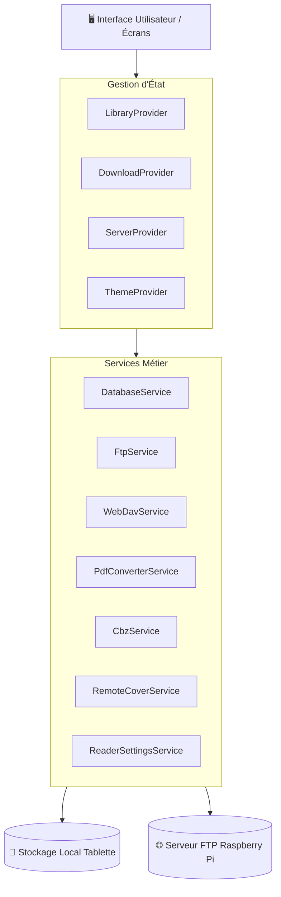
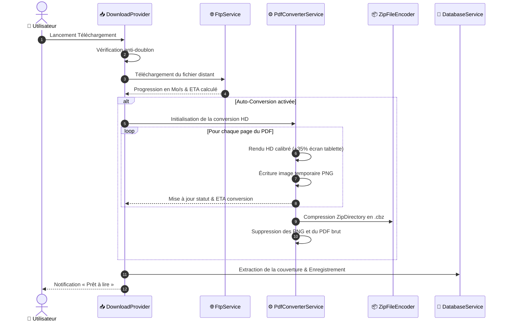

# 🏗️ Architecture Technique — ComicStream

Ce document décrit l'architecture logicielle, les flux de données et les pipelines de traitement de l'application **ComicStream**.

---

## 🧩 1. Architecture Globale des Modules



---

## 🔄 2. Pipeline de Téléchargement & Conversion PDF ➔ CBZ

Lorsqu'un utilisateur sélectionne une BD au format PDF :



---

## 🗃️ 3. Structure de Données Locale

```
📁 app_flutter/
├── 📁 books/                    # Archives de BDs locales
│   ├── book_1724610000_1.cbz    # Tomes téléchargés ou convertis
│   └── book_1724610000_2.pdf    # PDF conservés bruts
├── 📁 covers/                   # Couvertures extraites
│   ├── book_1724610000_1.jpg
│   └── book_1724610000_2.jpg
└── 📁 remote_covers_cache/      # Cache d'exploration du serveur distant
    └── a1b2c3d4e5f6.jpg
```

---

## 📱 4. Moteur de Lecture (`CbzReaderScreen` & `PdfReaderScreen`)

1. **`CbzReaderScreen`** :
   * Charge l'archive `.cbz` / `.zip` / `.cbr`.
   * Décode les images à la volée avec `FilterQuality.high` et `isAntiAlias: true`.
   * Gère les directions de lecture (Standard GàD, Manga DàG, Webtoon Vertical).
   * Mémorise la dernière page lue et met à jour la progression dans la base de données.
2. **`PdfReaderScreen`** :
   * Rendu matériel direct via le moteur C++ `pdfrx`.
   * Propose l'action « Convertir en BD (CBZ) » à tout moment depuis la barre supérieure.
