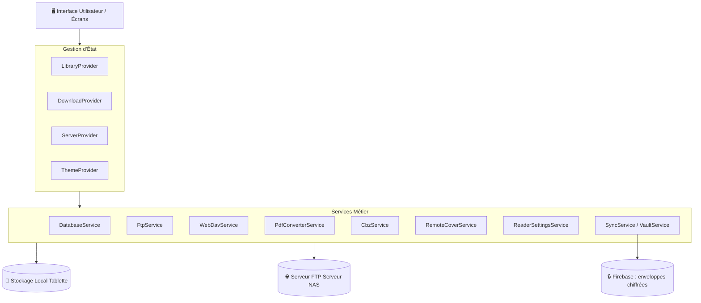
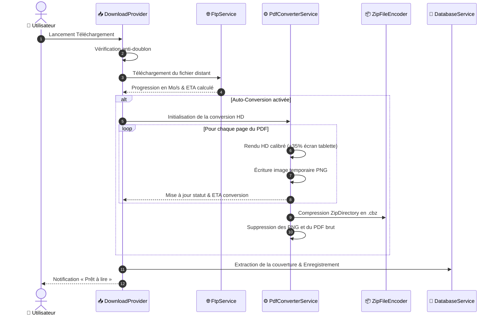

# 🏗️ Architecture Technique — ComicStream

## Outillage de présentation

`marketing/play-store/source/capture_app.dart` initialise les données fictives puis lance le vrai `ComicStreamApp` dans un paquet Android distinct. `prepare.py` prépare ce projet temporaire ; `capture_device.py` capture les écrans ; `render.mjs` compose les visuels HTML/CSS ; `package.py` valide et archive les exports. Cet outillage ne modifie pas le fonctionnement du lecteur en production.

Ce document décrit l'architecture logicielle, les flux de données et les pipelines de traitement de l'application **ComicStream**.

`AppTextScale`, appliqué par le `builder` de `MaterialApp`, borne le facteur de
texte système à 115 % afin de préserver la mise en page des contrôles sur les
téléphones étroits.

---

## 🧩 1. Architecture Globale des Modules



`SyncService` ne transmet que des enveloppes AES-256-GCM. `VaultService`
conserve la clé locale dans le stockage sécurisé de l'OS, permet sa
restauration par phrase de récupération, et permet la mise à jour de la phrase
secrète (`updateRecoveryPhrase`) en régénérant un nouveau sel PBKDF2 sans perte
des données déverrouillées. Les règles Firestore limitent chaque chemin
`users/{uid}` au compte authentifié correspondant.

`DatabaseService` publie les changements qui doivent être synchronisés.
`SyncProvider` les regroupe pendant cinq secondes puis déclenche une
synchronisation lorsque le compte et le coffre local sont disponibles. Les
applications distantes n'émettent pas à nouveau cet évènement : une réception
de données ne crée donc pas de boucle de synchronisation. La progression est
adressée par l'empreinte SHA-256 de chaque fichier importé ou téléchargé ; le
profil serveur et le chemin restent un repli pour les anciennes données sans
empreinte. Ainsi, un EPUB, PDF ou CBZ importé localement sur deux appareils
partage sa progression sans exposer ses chemins locaux.
Sous chaque document de livre, `SyncService` écrit une enveloppe distincte par
identifiant d’installation. Une synchronisation de fond n’écrase jamais deux
positions différentes provenant de deux appareils. `SyncedReaderGate` compare
ces instantanés à l’ouverture du lecteur et lors du retour de l’application au
premier plan, puis applique uniquement le choix explicite de l’utilisateur.
L’option distante remplace la page ou le chapitre et son avancement relatif,
mais conserve les favoris et marque-pages locaux. Une décision locale mémorise
la révision distante traitée afin de ne la reproposer qu’après une nouvelle
lecture sur cet appareil.
Les EPUB ajoutent à cet état l’avancement relatif du chapitre ; le lecteur le
convertit en défilement adapté à l’écran courant. La position exacte en pixels
reste locale et ne peut remplacer un autre chapitre reçu par synchronisation.
Les réglages sont horodatés seulement lors d’une modification locale, ce qui
évite les faux conflits d’un appareil à l’autre.
`DatabaseService` met les mutations de bibliothèque dans une file séquentielle
avant leur persistance. `SyncService` utilise un verrou commun aux instances du
service, de sorte que l’écran Compte et `SyncProvider` rejoignent la même
opération au lieu de concourir. Les mises à jour cloud sont publiées sur un
flux dédié pour recharger `LibraryProvider` sans déclencher de boucle de sync.
Un second flux notifie `ThemeProvider` lorsqu’un réglage distant est appliqué,
afin que le thème actif reflète la synchronisation sans redémarrage.

Chaque synchronisation conserve également un point de restauration global chiffré par
installation dans Firestore. Son nom est modifiable depuis Compte et inclus dans
l’enveloppe chiffrée ; l’alias par défaut ne comporte aucun modèle ou identifiant
matériel. Une synchronisation manuelle peut restaurer l’un de ces
points de restauration et le publier comme nouvelle référence commune ; ce
choix n’est jamais appliqué automatiquement et reste distinct du dialogue de
progression par livre.

L’onglet de navigation `DeviceFilesScreen` rend l’import local visible au même
niveau que les serveurs. Son action « Scanner le téléphone » utilise
`DeviceStorageAccessService` et le canal Android `comicstream/device_files`
pour demander et vérifier l’autorisation adaptée au système : accès spécial aux
fichiers sous Android 11+, permission de lecture sous Android 8–10. Une fois
accordé, `LocalBookImportService.scanDirectory` recherche récursivement les
formats compatibles dans le stockage partagé et ignore uniquement les
sous-dossiers système qu’Android ne rend pas accessibles ; l’utilisateur choisit ensuite
les éléments à importer.
`LocalBookImportService` copie ensuite chaque fichier retenu dans le stockage
privé de l’application avant d’en extraire les métadonnées et la couverture.
Cette copie évite de dépendre durablement de la disponibilité du fichier source.

`DatabaseService` marque les tomes tout juste téléchargés. Si `SyncService`
leur applique ensuite une progression distante, il émet un évènement local que
`LibraryProvider` transforme en unique action de reprise dans la bibliothèque.

---

## 🔄 2. Pipeline de Téléchargement & Conversion PDF ➔ CBZ

Lorsqu'un utilisateur sélectionne une BD au format PDF :



---

## 🗃️ 3. Structure de Données Locale

```
📁 app_flutter/
├── 📁 books/                    # Archives de BDs locales
│   ├── book_1724610000_1.cbz    # Tomes téléchargés ou convertis
│   └── book_1724610000_2.pdf    # PDF conservés bruts
├── 📁 covers/                   # Couvertures extraites
│   ├── book_1724610000_1.jpg
│   └── book_1724610000_2.jpg
└── 📁 remote_covers_cache/      # Cache d'exploration du serveur distant
    └── a1b2c3d4e5f6.jpg
```

---

## 📱 4. Moteur de Lecture (`CbzReaderScreen` & `PdfReaderScreen`)

1. **`CbzReaderScreen`** :
   * Charge l'archive `.cbz` / `.zip` / `.cbr`.
   * Décode les images à la volée avec `FilterQuality.high` et `isAntiAlias: true`.
   * Gère les directions de lecture (Standard GàD, Manga DàG, Webtoon Vertical).
   * Mémorise la dernière page lue et met à jour la progression dans la base de données.
2. **`PdfReaderScreen`** :
   * Rendu matériel direct via le moteur C++ `pdfrx`.
   * Propose l'action « Convertir en BD (CBZ) » à tout moment depuis la barre supérieure.
