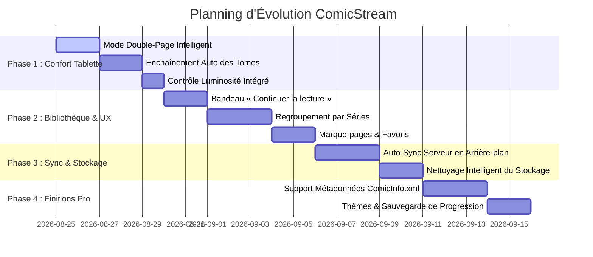

# 🗺️ Feuille de Route (Roadmap) — ComicStream

## Présentation Google Play — livrée

- [x] Six visuels téléphone et une bannière fondés sur des captures de la vraie application.
- [x] Quatre captures tablette sans habillage promotionnel.
- [x] Illustrations fictives, sources reproductibles et guide d’import dans `marketing/play-store/`.
- [ ] Remplacer les images de la fiche dans Play Console avec le lot validé.

Bienvenue sur la feuille de route du lecteur de BD / Manga **ComicStream**.  
Ce document détaille les phases de développement pour enrichir l'expérience sur tablette et serveur local.

---

---

## 📖 Phase 1 : Confort de Lecture & Expérience Tablette *(Priorité Immédiate)*

> **Objectif** : Exploiter à 100% l'écran 10.1 pouces (1920×1200) de la tablette pour une sensation papier authentique.

### 1.1 Mode Double-Page Intelligent (Paysage)
* **Affichage 2 pages côte à côte** en orientation paysage.
* **Gestion intelligente de la couverture** :
  * Page 1 (Couverture) affichée seule et centrée.
  * Pages suivantes (2-3, 4-5, etc.) affichées par paires.
  * Prise en charge des doubles-pages panoramiques intégrées.
* **Bascule instantanée** (1 page / 2 pages) dans la barre d'outils du lecteur.

### 1.2 Enchaînement Automatique des Tomes *(Binge-Reading)*
* **Transition fluide en fin de tome** : À la dernière page d'un album (ex: *Conquêtes T01*), proposition directe d'ouvrir le *Tome 02*.
* **Téléchargement à la volée** : Si le tome suivant est sur le serveur, téléchargement et ouverture en 1 tap.
* **Marquage automatique** du tome terminé avec badge `Lu ✅`.

### 1.3 Contrôle de Luminosité & Filtre Nuit Intégré
* Curseur de luminosité directement dans le lecteur pour la lecture nocturne.
* Mode Nuit avec fond noir pur AMOLED pour reposer les yeux.

---

## 📚 Phase 2 : Accueil & Organisation de la Bibliothèque

> **Objectif** : Retrouver ses BDs favorites en 1 seconde et reprendre sa lecture sans friction.

### 2.1 En-tête « Continuer la lecture » *(Hero Banner)*
* Affichage en tête de liste de la dernière BD en cours de lecture :
  * Grande couverture + Titre du tome.
  * Progression en pourcentage et numéro de page.
  * Gros bouton **« Reprendre »** pour replonger dans l'histoire en 1 tap.

### 2.2 Regroupement Automatique par Séries / Collections
* Vue dédiée **« Séries »** :
  * Détection automatique des sagas (*ex: « XIII (24 tomes) », « Conquêtes (10 tomes) », « Sillage (33 tomes) »*).
  * Dossier virtuel avec couverture du Tome 1 et décompte des tomes possédés vs restants sur le serveur.
  * Tri naturel des numéros de tomes (T01, T02, T03... T10).

### 2.3 Marque-pages Visuels & Favoris
* Liste rapide des pages marquées avec miniatures.
* Onglet **Favoris ❤️** pour épingler ses séries en cours.

---

## ⚡ Phase 3 : Synchronisation Serveur & Gestion du Stockage

> **Objectif** : Gérer automatiquement les transferts entre le Serveur NAS et la mémoire de la tablette.

### 3.1 Détection & Notification des Nouveaux Tomes
* Scan silencieux du serveur FTP/WebDAV au lancement.
* Badge de notification si de nouveaux tomes ou séries ont été ajoutés sur le serveur.

### 3.2 Gestionnaire d'Espace & Nettoyage Intelligent
* Visualiseur de mémoire occupée (Mo / Go) par série.
* Option **« Supprimer les tomes lus »** en 1 clic pour libérer du stockage tout en gardant l'historique.
* Alerte automatique en cas d'espace disque faible.

---

## 💎 Phase 4 : Métadonnées & Personnalisation Pro

### 4.1 Métadonnées et Résumés (ComicInfo.xml / CBZ Info)
* Extraction automatique des synopsis, scénaristes, dessinateurs, éditeurs et années de parution.
* Fiche détaillée d'un album avec résumé avant d'ouvrir la BD.

### 4.2 Sauvegarde & Restauration de la Progression
* Export/Import des statistiques et progressions de lecture (JSON / Serveur).
* Thèmes visuels avancés (Sombre BD, Manga Minimaliste, Vintage Comics).
# Roadmap — comptes et synchronisation

## En cours — fondation Firebase sécurisée

- [x] Définir Firebase Auth + Firestore comme backend de comptes.
- [x] Chiffrer côté client les profils serveur, progression et réglages.
- [x] Placer les mots de passe de serveurs dans le coffre sécurisé de l'OS.
- [x] Ajouter des règles Firestore limitées au compte propriétaire.
- [x] Définir la détection des écritures concurrentes par fichier.
- [x] Permettre de résoudre les conflits en choisissant la version locale ou
  Google, avec les dates de modification.
- [x] Identifier les BD synchronisées par empreinte SHA-256, avec repli sur le
  serveur et le chemin pour les archives historiques.
- [x] Ajouter les écrans d'inscription, connexion, saisie/confirmation de
  phrase de récupération, boîte de dialogue de confirmation, masquage/affichage
  et modification de phrase secrète.
- [ ] Connecter le projet Firebase de production et ses applications clientes.
- [x] Ajouter la synchronisation déclenchée automatiquement après connexion et
  après une modification de bibliothèque ou de lecture.
- [x] Importer et lire des fichiers déjà présents sur l’appareil, sans serveur,
  via un onglet dédié ne proposant que les formats lisibles.
- [x] Proposer de reprendre un tome téléchargé lorsque sa progression
  synchronisée est restaurée.
- [x] Conserver une sauvegarde chiffrée par appareil et permettre de choisir
  explicitement celle qui devient la référence lors d’une synchronisation
  manuelle.
- [x] Permettre de nommer chaque appareil pour distinguer ses sauvegardes.
- [ ] Déclencher une nouvelle tentative au retour réseau.

## Prochaine étape — qualité de production

- [ ] Tests unitaires du chiffrement, du coffre et des cas de conflit.
- [ ] Tests des règles Firestore avec l'émulateur Firebase.
- [ ] Activer App Check et tester la restauration sur plusieurs appareils.
- [ ] Audit des flux OAuth Google et Apple sur les plateformes publiées.
